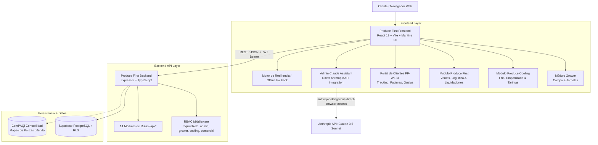

# Produce First ERP - Documentación Técnica del Sistema

Sistema Integral de Planificación de Recursos Empresariales (ERP) para la agroindustria de exportación de hortalizas y vegetales frescos. Cubre de extremo a extremo el ciclo de vida operativo, frío, comercial y financiero:

1. **Grower (Campo & Agrícola)**: Control de ranchos, parcelas/lotes, jornales, labores agrícolas y costos de empaque en campo.
2. **Produce Cooling (Manejo Postcosecha & Cadena de Frío)**: Recepción de cosecha, escaneo de tarimas, hidroenfriado, cuartos de conservación, inyección de hielo líquido, bitácoras de servicio y maquila.
3. **Produce First (Comercializadora, Logística & Liquidaciones)**: Planificación de ventas, proformas de embarque, asignación de transportistas, liquidaciones a productores, control de cuentas corrientes y **Portal de Clientes (`PF-WEB1`)**.
4. **Inteligencia Ejecutiva con Claude AI**: Asistente integrado exclusivamente para administradores del sistema con contexto operativo 360°.

---

## 🏗️ Arquitectura General



---

## 📂 Estructura de Proyectos

El repositorio está organizado en dos componentes principales:
* **Frontend:** `c:\Users\echoe\daia\produce-first-frontend`
* **Backend:** `c:\Users\echoe\daia\produce-first-back`

---

## 🎨 1. Frontend (`produce-first-frontend`)

### Stack Tecnológico
- **Framework:** React 19 (`react` ^19.2.7)
- **Tooling:** Vite 8 (`vite` ^8.1.1) + TypeScript 6 (`typescript` ~6.0.2)
- **UI Kit & Estilos:** Mantine UI v9 (`@mantine/core`, `@mantine/hooks`, `@mantine/form`) con tema personalizado Agro (`#1F5C3A`, `#8A5A2A`, etc.)
- **Iconos:** `@tabler/icons-react` v3.44
- **Enrutamiento:** React Router DOM v7 (`react-router-dom` ^7.18.1)
- **Visualización de Datos:** Recharts (`recharts` ^3.10.1)
- **Generación de Códigos QR:** `qrcode.react` ^4.2.0

### Estructura de Directorios Clave
```
produce-first-frontend/
├── src/
│   ├── components/
│   │   ├── admin/
│   │   │   └── AdminClaudeChatbot.tsx    # Asistente flotante exclusivo para rol admin
│   │   ├── MainLayout.tsx                # AppShell con sidebar, cabecera y acciones rápidas
│   │   ├── ProtectedRoute.tsx            # Filtro de autenticación y RBAC (allowedRoles)
│   │   └── Sidebar.tsx                   # Navegación segmentada por área operativa
│   ├── modules/
│   │   ├── grower/                       # Módulo Agrícola (ranchos, lotes, jornales)
│   │   ├── produce-cooling/              # Módulo de Frío (13 submódulos conectados)
│   │   │   ├── ReceptionScan/            # Escaneo y validación de tarimas de cosecha
│   │   │   ├── TrazabilidadInventario/   # Kardex de tarimas, zonas y cuartos fríos
│   │   │   ├── BitacorasVentasServicios/ # Registros de vacío, hidrocooling, hielo
│   │   │   ├── OrdenesEmbarque/          # Despacho en piso vs proformas
│   │   │   ├── CashFlow/                 # Flujo de caja y conciliación bancaria
│   │   │   └── ...
│   │   └── produce-first/                # Comercializadora (18 submódulos)
│   │       ├── PortalClientes/           # PF-WEB1: Portal público/privado de clientes
│   │       ├── MotorLiquidaciones/       # Cálculo neto a productores (comisiones, frío)
│   │       ├── Proforma/                 # Emisión de proformas comerciales a logística
│   │       ├── PlanificadorCarga/        # Asignación de fletes y cubicaje de camiones
│   │       └── ...
│   ├── services/
│   │   ├── ai/
│   │   │   └── claudeService.ts          # Integración directa con Anthropic Messages API
│   │   ├── apiClient.ts                  # Cliente Axios/Fetch central con JWT y refresh token
│   │   └── ...                           # Servicios por dominio (Growers, Frío, Finanzas)
│   └── theme/                            # Paletas de color Mantine (growerGreen, earthBrown)
```

### Resiliencia y Offline Fallback
Cada submódulo implementa un patrón de carga dual:
1. Consulta prioritaria al endpoint REST del backend a través de `apiClient`.
2. En caso de timeout, error de red o base de datos vacía, conmuta transparentemente a una estructura local estructurada (`mockFallback`), garantizando cero bloqueos o pantallas en blanco en piso operativo.

---

## ⚙️ 2. Backend (`produce-first-back`)

### Stack Tecnológico
- **Runtime:** Node.js + TypeScript (`typescript` ^6.0.3) con soporte para ESM (`"type": "module"`)
- **Framework Web:** Express 5 (`express` ^5.2.1)
- **Base de Datos:** PostgreSQL administrado en Supabase (`@supabase/supabase-js` ^2.106.2)
- **Seguridad:** Encriptación con `bcryptjs`, JWT y validación con `zod`
- **Generación de Reportes:** `exceljs`, `xlsx`, `pdfkit`
- **Ejecución en Desarrollo:** `tsx` watch

### Middleware de Seguridad y RBAC
1. **`authWithFilter.ts`**: Valida el token JWT Bearer, resuelve el perfil del usuario en la base de datos de Supabase y rechaza con `403 Forbidden` accesos no identificados. Se ha eliminado cualquier fallback inseguro.
2. **`requireRole.ts`**: Middleware de autorización declarativa:
   ```typescript
   export const requireRole = (allowedRoles: string[]) => {
     return (req: Request, res: Response, next: NextFunction) => {
       if (!req.user || !allowedRoles.includes(req.user.role)) {
         return res.status(403).json({ error: 'Acceso no autorizado para este rol' });
       }
       next();
     };
   };
   ```

### Módulos de Rutas (`/api/*`)
| Prefijo de Ruta | Controlador Principal | Descripción |
| :--- | :--- | :--- |
| `/api/auth` | `authRoutes` | Login, emisión de JWT, obtención de perfil y refresh tokens |
| `/api/users` | `userRoutes` | Gestión de usuarios, asignación de roles y PINs (restringido a `admin`) |
| `/api/growers` | `growerRoutes` | Catálogo de productores, fichas técnicas y acuerdos comerciales |
| `/api/harvest-receptions` | `receptionRoutes` | Recepción de cosecha, pesado y escaneo de lotes en rampa |
| `/api/lots` | `lotRoutes` | Parcelas, polígonos, fechas de siembra y estatus agronómico |
| `/api/cooling` | `coolingRoutes` | Inventario de cámaras frigoríficas y lecturas térmicas |
| `/api/logbook` | `logbookRoutes` | Bitácoras de servicios de frío (pre-cooling, enhielado, repacking) |
| `/api/sales` | `salesRoutes` | Pedidos de venta, proformas y asignación a clientes |
| `/api/customers` | `customerRoutes` | Directorio de distribuidores/brokers y condiciones de crédito |
| `/api/liquidation-pf` | `liquidationRoutes` | Motor de cálculo de liquidaciones a productores |
| `/api/contpaqi` | `contpaqiRoutes` | Interfaz de mapeo contable y exportación de pólizas |
| `/api/cashflow` | `cashflowRoutes` | Conciliación de cuentas de banco y proyecciones de tesorería |

---

## 🌐 3. Portal de Clientes (`PF-WEB1`)

El submódulo `PF-WEB1` sustituye la dependencia de portales de terceros y concentra el autoservicio para compradores internacionales:
- **Ruta:** `/produce-first/pfw1` (alias: `/portal-clientes`)
- **Funcionalidades:**
  - **KPIs en Vivo:** Saldo pendiente, cajas en ruta, términos de crédito comercial y estado de reclamos.
  - **Embarques y Tránsito:** Visualización de manifiestos, placas de transporte, estimación de llegada (ETA) y monitoreo de temperatura de caja (Thermo King a 34°F).
  - **Facturación y Descarga:** Consulta de estatus de cobro y descarga de documentos fiscales PDF / XML.
  - **Reclamos de Calidad:** Formulario estructurado para ingresar quejas de mercancía dañada o deshidratada, adjuntar evidencia fotográfica y ligar el folio automáticamente a deducciones en `PF-LQC`.
  - **Instrucciones Bancarias:** Datos de transferencia internacional Wire y transferencias domésticas ACH (Wells Fargo).

> **Nota de Diseño:** El portal de productores (`PF-WEB2`) ha sido formalmente descartado según los requerimientos del negocio, centralizando el esfuerzo en el Portal de Clientes y la liquidación interna.

---

## 🤖 4. Asistente Ejecutivo Claude (Exclusivo Administrador)

### Características
- **Acceso Restringido:** El componente `AdminClaudeChatbot.tsx` valida estrictamente que `user?.role === 'admin'`. Otros usuarios no ven el botón ni ejecutan consultas.
- **Seguridad de Credenciales:** La API Key de Anthropic (`sk-ant-...`) es ingresada directamente por el usuario administrador en el panel de configuración y se almacena localmente en su navegador (`localStorage: produce_first_anthropic_key`).
- **Contexto Operativo 360°:** El servicio `claudeService.ts` incluye un system prompt especializado en la operación hortícola e inyecta dinámicamente el estado de:
  - **Grower:** Lotes activos, gastos de campo y nóminas.
  - **Produce Cooling:** Ocupación de cuartos fríos, tarimas en piso y servicios de enfriamiento.
  - **Produce First:** Pedidos comerciales, comisiones, cuentas corrientes y estatus de cobro.
- **Acciones Rápidas:** Botones preconfigurados para auditoría de P&L semanal, análisis de liquidaciones netas, diagnóstico térmico de inventario y análisis de riesgo de clientes.

---

## 🚀 5. Guía de Instalación y Puesta en Marcha

### Requisitos Previos
- **Node.js:** v20+ o v22+
- **NPM** o **Yarn / PNPM**
- Cuenta activa en **Supabase** con las variables de entorno configuradas

### A. Configuración del Backend
```bash
cd c:\Users\echoe\daia\produce-first-back

# 1. Instalar dependencias
npm install

# 2. Configurar variables de entorno (.env)
# SUPABASE_URL=https://xxxx.supabase.co
# SUPABASE_KEY=eyJhbGciOi...
# JWT_SECRET=super_secret_jwt_key
# PORT=3000

# 3. Iniciar en modo desarrollo
npm run dev

# 4. Compilar para producción
npm run build
npm run start
```

### B. Configuración del Frontend
```bash
cd c:\Users\echoe\daia\produce-first-frontend

# 1. Instalar dependencias
npm install

# 2. Configurar variables de entorno (.env)
# VITE_API_BASE_URL=http://localhost:3000/api
# VITE_SUPABASE_URL=https://xxxx.supabase.co
# VITE_SUPABASE_ANON_KEY=eyJhbGciOi...

# 3. Iniciar servidor de desarrollo (Vite)
npm run dev

# 4. Compilación y verificación de producción
npm run build
```

---

## 🧪 6. Matriz de Roles y Permisos (RBAC)

| Rol del Sistema | Grower (Campo) | Produce Cooling | Produce First | Portal Clientes | Claude Assistant |
| :--- | :---: | :---: | :---: | :---: | :---: |
| `admin` | Total | Total | Total | Total | ✅ Sí |
| `grower` | Lectura / Captura | Solo Recepción | Solo Consulta CC | ❌ No | ❌ No |
| `cooling` | ❌ No | Total | Solo Proformas | ❌ No | ❌ No |
| `comercial` | ❌ No | Solo Lectura Inv. | Total | Consulta | ❌ No |
| `customer` | ❌ No | ❌ No | ❌ No | Total (`PF-WEB1`) | ❌ No |
